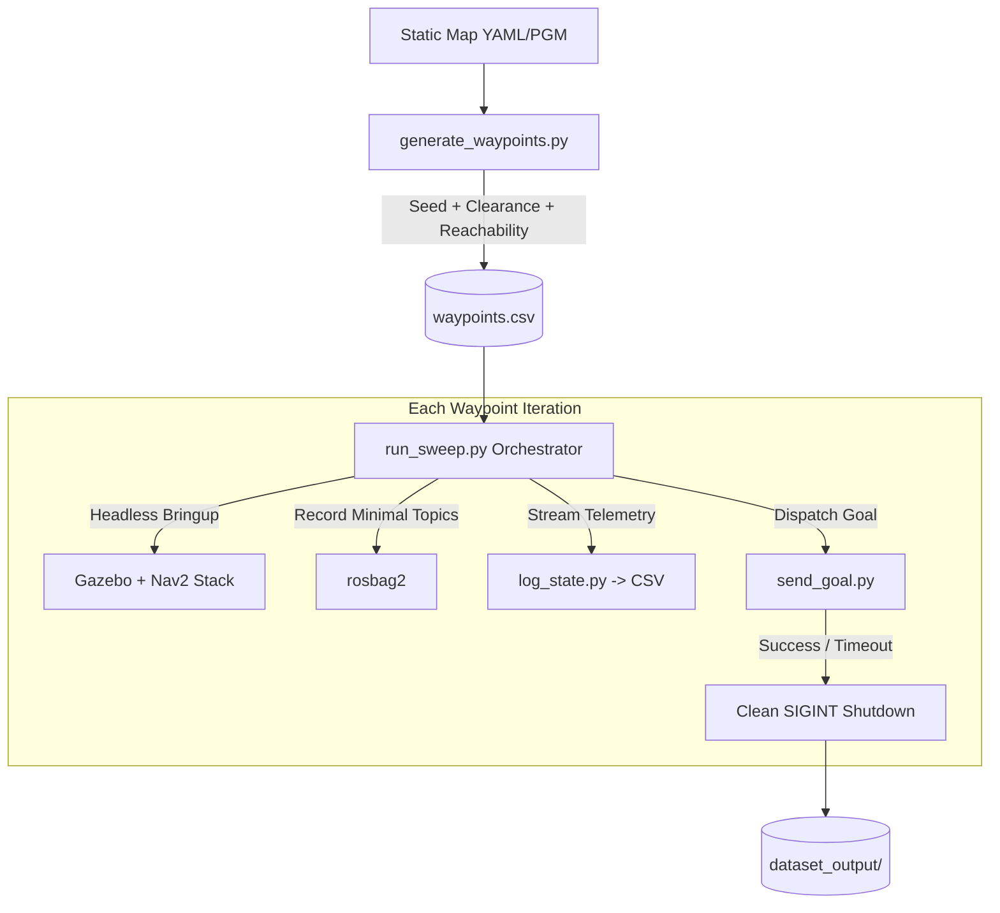

# Simulation Trajectory Sweep Architecture & Design ("The Why")

This document details the architecture, design decisions, and operational mechanics for the automated simulation trajectory sweep system used to generate ML training datasets from Nav2 and Gazebo.

---

## 1. System Overview

The pipeline automates end-to-end data collection across pseudo-randomized routes in Gazebo:



---

## 2. Architectural Decisions & Rationale ("The Why")

### A. Free-Space Erosion & Clearance Buffering
* **The Problem:** In standard ROS 2 occupancy grids, any pixel with low probability ($occ < free\_thresh$) is designated as free space. This includes cells immediately adjacent to warehouse racks, steel columns, and walls.
* **Failure Mode:** Spawning the Clearpath Husky A200 ($1.1\text{ m} \times 0.9\text{ m}$ footprint, $\sim 0.45\text{ m}$ inscribed radius) adjacent to a surface causes mesh clipping or physics instability in Gazebo. Furthermore, Nav2's costmap inflation layer marks cells near obstacles with lethal or high-inscribed cost; Nav2's collision monitor clamps velocities to zero, preventing motion.
* **The Design:** We perform morphological erosion (`cv2.erode`) on the binary free mask using an elliptical structuring element:
  $$R_{\text{px}} = \left\lceil \frac{\text{clearance\_m}}{\text{map\_resolution}} \right\rceil$$
  Setting `--clearance 0.6` ensures all sampled coordinates provide at least $60\text{ cm}$ of radial clearance from physical barriers and unknown boundaries.

### B. Topological Reachability (Connected Component Analysis)
* **The Problem:** Real-world facility maps contain closed bounding boxes, interior pallet islands, and sealed partitions.
* **Failure Mode:** Independent random sampling across raw free space frequently places the start point on one side of a partition and the goal in a disconnected room or inside a hollow crate. In Nav2, this results in eternal planning failure, repeated recovery behaviors (`Spin`, `BackUp`), and timeouts.
* **The Design:** We run 8-way connected-component labeling (`cv2.connectedComponentsWithStats`) on the eroded free-space mask and isolate the largest contiguous navigable component. Both start and goal coordinates are sampled strictly from this component, guaranteeing topological 2D reachability before any simulation is launched.

### C. Configurable Random Seeds & Full Determinism
* **The Problem:** ML research and benchmark reproducibility require that specific trajectory datasets can be regenerated identically on demand.
* **The Design:** By default, sampling is non-deterministic (system entropy). For reproducible benchmarks or dataset regeneration, passing an explicit `--seed <INT>` seeds both Python's built-in `random` and NumPy's PRNG. Because map image parsing, component extraction, and indexing are ordered, providing the same seed and map produces byte-identical waypoint files across runs and machines.

### D. Dual Yaw Representation (`rad` and `deg`)
* **The Problem:** Angular interfaces across this ROS 2 stack use contradictory units:
  - `a200_point_nav.launch.py` (and Gazebo entity spawning) consumes yaw in **radians**.
  - `send_goal.py` expects CLI yaw in **degrees** (`send_goal.py X Y [YAW_DEG]`).
* **Failure Mode:** Passing radians to `send_goal.py` results in goals facing near $0^\circ$; passing degrees to the launch file causes chaotic initial robot headings.
* **The Design:** The exported CSV explicitly carries `start_yaw_rad`, `start_yaw_deg`, and `goal_yaw_deg`. Downstream runner scripts bind directly to the required unit without runtime conversion heuristics.

### E. Dissimilarity and Reciprocal Route Filtering
* **The Problem:** Uniform sampling produces redundant clusters of identical paths and trivial reciprocal routes ($A \rightarrow B$ followed by $B \rightarrow A$).
* **The Design:** Each candidate pair $(s_{\text{cand}}, g_{\text{cand}})$ must satisfy:
  1. Euclidean path length: $\text{min\_dist} \le \|g - s\| \le \text{max\_dist}$.
  2. Forward uniqueness: $\min(\|s_{\text{cand}} - s_{\text{prev}}\|, \|g_{\text{cand}} - g_{\text{prev}}\|) \ge \text{similarity\_thresh}$.
  3. Reverse uniqueness: $\min(\|s_{\text{cand}} - g_{\text{prev}}\|, \|g_{\text{cand}} - s_{\text{prev}}\|) \ge \text{similarity\_thresh}$.
  This maximizes geometric diversity across the dataset.

### F. Output Decoupling
* **The Problem:** Storing generated CSVs, rosbags, or previews within `src/nav_worlds/` pollutes Git tracking, risks committing large binaries, and causes permission collisions in CI/Docker workspaces.
* **The Design:** Data products default to `data/` in the active workspace root or an explicit `--output` target. Code remains clean and versioned independently from experimental datasets.

### G. Near-Realtime RTF for Initial Stability
* **The Problem:** Increasing Gazebo's Real-Time Factor (RTF $\gg 1$) too early can starve CPU resources, causing the controller manager spawner or SLAM toolbox lifecycle transitions to fail during mesh loading.
* **The Design:** Initial validation and sweeps are capped near RTF $\sim 1.0$. Once process stability is proven, physics update rates can be dialed up safely.

### H. Modular SimulationRunner Architecture & Warm Reset Extensibility
* **The Problem:** Full simulator restarts ("Cold Restarts") guarantee zero state leakage between trajectories, but incurs initial mesh and node launch overhead. Future scaling may leverage in-process warm resets.
* **The Design:** `run_sweep.py` structures orchestration into an abstract base class `SimulationRunner` and a concrete `ColdRestartRunner`. `SimulationRunner` manages waypoint ingestion, output directories, and sweep metadata tracking. `ColdRestartRunner` encapsulates the cold restart lifecycle (Gazebo process spin-up, rosbag/state logger capture, goal dispatch, and teardown). An upcoming `WarmResetRunner` can inherit from `SimulationRunner` and implement `run_trajectory()` using Gazebo `/world/<name>/set_pose` and Nav2 initial pose reset services without rewriting orchestrator logic.

### I. TwistStamped Message Alignment & DDS Multi-Type Conflict Resolution
* **The Problem:** In ROS 2 Jazzy, Clearpath robot platforms publish stamped velocity commands (`geometry_msgs/msg/TwistStamped`) on `/{namespace}/cmd_vel`. Subscribing with legacy unstamped `geometry_msgs/msg/Twist` in downstream loggers creates a dual-type collision on the DDS topic graph.
* **Failure Mode:** `ros2 bag record` emits `[ROSBAG2_TRANSPORT]: Topic '/a200_0000/cmd_vel' has more than one type associated. Skipping.` and ignores the topic. Furthermore, the telemetry logger receives deserialization failures and logs zero velocities.
* **The Design:** `log_state.py` subscribes to `geometry_msgs/msg/TwistStamped` by default (extracting `msg.twist.linear.x` and `msg.twist.angular.z`), while offering an optional `--unstamped_cmd_vel` flag for legacy robots. This allows both `ros2 bag record` and `state.jsonl` to reliably capture commanded velocities without DDS graph collisions.

### J. Static Global Costmap Bounds (`nav2_static.yaml`)
* **The Problem:** Clearpath's default `a200/nav2.yaml` sets `rolling_window: true` ($20\text{ m} \times 20\text{ m}$) on the `global_costmap`. Because rolling windows are robot-centered ($\pm 10\text{ m}$ reach), any waypoint exceeding $10\text{ m}$ Euclidean distance from the spawn location is rejected at second 0 by NavfnPlanner with `"Goal Coordinates was outside bounds"`.
* **The Design:** Rather than modifying the shared base configuration in `clearpath_nav2_demos`, we duplicated the configuration into `src/nav_worlds/config/nav2_static.yaml` with `global_costmap.rolling_window: false`. In static map localization mode (`slam:=false`), `a200_point_nav.launch.py` automatically routes to `nav2_static.yaml`, sizing the global costmap to the full $30\text{ m} \times 50\text{ m}$ warehouse bounds while preserving stock default behavior elsewhere.

### K. Visual Debugging Mode (`--gui` & `--rviz`)
* **The Problem:** Headless sweeps operate entirely in the background. When a robot gets caught on an obstacle, spins out, or fails to navigate, diagnosing whether the root cause is physics contact, costmap inflation, or localization drift is difficult from headless logs alone.
* **The Design:** `run_sweep.py` exposes `--gui` (spawns Gazebo GUI via `headless:=false`) and `--rviz` (spawns RViz via `rviz:=true`). Per `AGENTS.md` Rule 1, any sweep launched with `--gui` must be executed with sandbox bypass (`BypassSandbox: true`) to permit access to host display sockets (`/tmp/.X11-unix`).
* **Clean GUI Teardown:** In `sim.launch.py`, Gazebo is launched directly via `ExecuteProcess(..., shell=False)` rather than `ros_gz_sim`'s wrapper (which uses `shell=True`). This direct invocation ensures ROS 2 launch shutdown signals propagate straight to the `gz` Ruby wrapper, allowing its `Signal.trap("INT")` handler to cleanly terminate the detached `gz-sim-gui` Qt window without leaving lingering display windows upon trajectory completion.

### L. Safe Orphan Cleanup (Self-Termination Avoidance)
* **The Problem:** When `run_sweep.py` is executed via `ros2 run nav_worlds run_sweep.py`, a naive `pkill -9 -f "ros2"` command kills `run_sweep.py` itself and its parent launcher process, abruptly terminating the entire sweep.
* **The Design:** `cleanup_orphans()` queries `pgrep -f ros2`, filters out `os.getpid()` and `os.getppid()`, and terminates only orphaned simulation and middleware processes before and after each trajectory run.

---

## 3. Dataset Output Specification

Each sweep execution generates a timestamped directory structure:

```text
data/dataset_output/
  sweep_YYYYMMDD_HHMMSS/
    sweep_metadata.csv         # Execution summary (run_id, start_x, start_y, goal_x, goal_y, status, elapsed_time)
    run_000/
      bag/                     # ROS 2 bag (tf, tf_static, odom, scan_filtered, cmd_vel, plan, clock)
      state.jsonl              # High-rate synchronized state (time, pose_x, pose_y, yaw, vx, wz, 720-beam scan)
    run_001/
      ...
```

### Telemetry JSON Lines (`state.jsonl`) Schema
Each line represents a synchronized telemetry sample triggered by the 2D LiDAR callback:
```json
{
  "timestamp": 1726001234.567,
  "x": 4.125,
  "y": -2.314,
  "yaw": 1.5708,
  "vx": 0.495,
  "wz": 0.012,
  "scan": [1.42, 1.45, null, ..., 5.82]
}
```

---

## 4. CLI Quick Reference

```bash
# 1. Generate deterministic waypoints with visualization:
ros2 run nav_worlds generate_waypoints.py \
  --map-yaml $(ros2 pkg prefix clearpath_nav2_demos)/share/clearpath_nav2_demos/maps/warehouse.yaml \
  --seed 42 \
  -n 10 \
  --min-dist 4.0 \
  --clearance 0.6 \
  --similarity-thresh 2.0 \
  -o data/warehouse_waypoints.csv \
  --preview data/warehouse_preview.png

# 2. Run automated headless simulation sweep (3 trajectories):
ros2 run nav_worlds run_sweep.py \
  --waypoints data/warehouse_waypoints.csv \
  --max_runs 3

# 3. Run sweep with visual debugging (Gazebo GUI and RViz):
# (Note: Requires BypassSandbox: true for X11 display socket access)
ros2 run nav_worlds run_sweep.py \
  --waypoints data/warehouse_waypoints.csv \
  --max_runs 1 \
  --gui \
  --rviz
```
